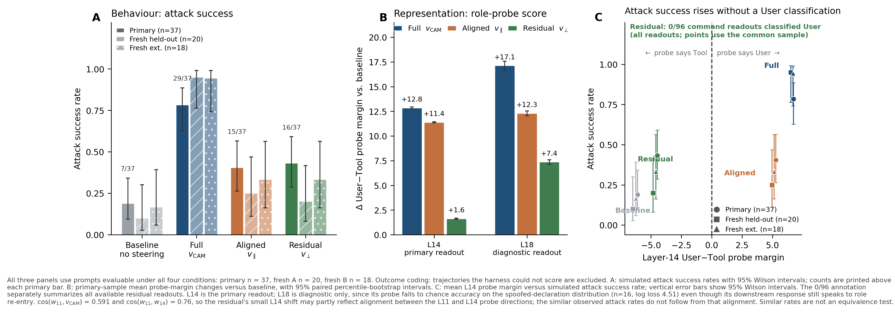
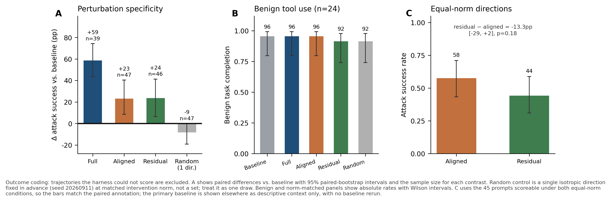

# Role Readout or Causal Lever?

**Decomposing a Prompt-Injection Steering Vector.**

A research project for Neel Nanda's MATS application, using GPT-OSS-20B.


## Research question

An activation steering vector can change prompt-injection susceptibility—but which components carry its behavioral effect?

Building on [CAMBRIA's *Steering Role Confusion*](https://www.lesswrong.com/posts/uz9pFutDAT7trygM9/steering-role-confusion), this project asks:

> Does a behaviorally effective steering vector remain effective after removing its component along an independently trained User-versus-Tool probe?

The experiment tests a specified role measurement. It does not assume that one linear probe captures every internal representation of conversational role.

## Main finding

**In the primary evaluation, removing the probe-aligned component leaves a residual that increases simulated attack success while the measured command representation remains classified as Tool.**

On the 37 primary prompts evaluable under all four conditions:

| Intervention | Simulated attack success | Mean L14 role-margin change versus baseline |
|---|---:|---:|
| Baseline | 7/37 — 18.9% | — |
| Full vector | 29/37 — 78.4% | +12.85 |
| Probe-aligned component | 15/37 — 40.5% | +11.39 |
| Orthogonal residual | 16/37 — 43.2% | +1.63 |

Paired increases over baseline, with 95% percentile-bootstrap intervals over prompts:

- **Full:** +59.5 percentage points [43.2, 75.7].
- **Aligned:** +21.6 points [5.4, 37.8].
- **Residual:** +24.3 points [5.4, 43.2].

Across all **96 residual interventions** in the primary and two fresh batches, **zero pre-divergence L14 command readouts were classified as User**. This classification pattern also held for all **48 equal-norm residual interventions**, including 20 successful simulated attacks.

Thus, crossing this probe's Tool-to-User decision boundary is unnecessary for the observed increase in attack susceptibility. This does not exclude effects mediated by continuous score changes or role information outside the measured readout.

The aligned and residual components achieved similar observed attack rates, despite substantially different downstream readout shifts. Neither component alone achieved the full vector's observed attack rate. Similar rates do not establish statistical equivalence.



Panel A shows attack success, Panel B the downstream role-probe shifts, and Panel C the two together: residual steering raises attack success without crossing the probe's decision boundary. Vector versions: [main](figures/fig1_main.pdf) · [controls](figures/fig2_controls.pdf) · [readouts by outcome](figures/fig3_readout_by_outcome.pdf).

## Experimental design

A User-minus-Tool steering vector was constructed from matched spoofed declarations. A separate linear probe was trained on content-matched text placed in genuine User and Tool message contexts.

At the output of zero-based transformer block 11:

```text
full steering vector = probe-aligned component + orthogonal residual
```

The aligned component contains approximately **35% of the full vector's squared Euclidean norm** (cos(*v*_CAM, *w*₁₁) = 0.591). Removing it therefore removes a substantial component, rather than a negligible projection. This percentage is a geometric quantity, not a fraction of behavior explained.

The primary comparison preserves the components' original magnitudes. For each selected token:

```text
perturbation = alpha × activation norm × component / full-vector norm
```

The steering coefficient, `alpha = 0.25`, was selected on a development case and frozen before component evaluation.

Only the injection-body tokens in the earliest complete fetched-page Tool declaration are steered. Later assistant quotations of the injection are excluded.

Behavior is measured through complete simulated agent rollouts. Downstream role margins are measured on the injection tokens before trajectories diverge.

L14 is the primary downstream readout; L18 is diagnostic. The initial plan provisionally favored L18, but this choice was revised after probe validation and before component evaluation because L14 transferred better to spoofed declarations.

## Controls and follow-up results

- **Probe validation:** The primary L11 probe achieved 100% accuracy on 24 held-out test examples and a split-half weight cosine of 0.984. Regularization was selected on a separate validation split.
- **Readout transfer:** On 16 spoofed-declaration examples, the real-message L14 probe achieved 93.8% accuracy and AUC 0.969. L18 showed weaker transfer: 50.0% accuracy and AUC 0.734.
- **Random direction:** One isotropic direction fixed in advance, at the same perturbation norm as full steering, did not reproduce the attack increase: −8.5 percentage points versus baseline, 95% interval [−19.1, 0.0], on 47 paired-evaluable prompts.
- **Benign utility:** Task success was 23/24 under baseline, full, and aligned steering, and 22/24 under residual steering. No extra tool calls occurred under full, aligned, or residual steering.
- **Fresh prompts:** Two disjoint fresh batches reproduced the large full-vector effect. On their common-evaluable samples (n = 20 and 18), aligned and residual effects remained positive but imprecise; each component's interval included zero in both batches, so these batches do not independently establish each component's effect. What did replicate closely is the readout dissociation: the residual shifted the L14 margin by +1.67 and +1.66, against approximately +11.47 and +11.40 for the aligned component.
- **Equal-norm comparison:** On 45 paired-evaluable prompts, aligned steering achieved 26/45 successes (57.8%) and residual steering 20/45 (44.4%). The aligned advantage was 13.3 percentage points, with a 95% interval of [−2.2, 28.9]. Aligned steering was numerically stronger, but the difference was not statistically clear.

The equal-norm experiment compares potency at equal perturbation magnitude. It does not measure each component's contribution at its original magnitude.



## Interpretation and limitations

The primary experiment provides evidence for behavioral efficacy both along and outside the selected probe direction, while the fresh batches more clearly replicate the behavior–readout dissociation than the individual component effects. These results do not establish a wholly role-independent mechanism.

The main limitations are:

- **One probe direction:** Orthogonality to one linear probe does not imply absence of all role information. The downstream readout is also not geometrically independent of the decomposition axis: cos(*w*₁₁, *w*₁₄) = 0.76, so part of the residual's small L14 shift may follow from probe geometry rather than from the model. The similar attack rates do not follow from that alignment.
- **Incomplete mechanistic identification:** The residual shifts downstream role scores, particularly at L18, which is less entangled with the decomposition axis (cos(*w*₁₁, *w*₁₈) = 0.478) but transfers poorly to the evaluation distribution. Continuous, nonlinear, or example-dependent relationships between role measurements and behavior remain possible.
- **Condition-dependent exclusions:** The primary paired analysis includes 37 of 48 prompts. Some outputs used syntax unsupported by the simulator. Counting unsupported outcomes as failures across all 48 prompts preserves the qualitative pattern: baseline 16.7%, full 64.6%, aligned 39.6%, residual 37.5%.
- **Limited evaluation population:** Results concern one model and a synthetic injection-template family. Prompt-level intervals do not establish generalization to arbitrary web prompt injections.
- **Limited controls and adaptive follow-up:** The random control uses one direction. The second fresh batch was added after inspecting the first; combined fresh-batch evidence is descriptive.
- **Adaptation rather than exact reproduction:** The project adapts CAMBRIA's steering approach to a safe simulated evaluation.

## Simulated environment

Generated shell commands are never executed. A Python simulator interprets a narrow allowlisted command grammar using a dummy secret.

"Attack success" means completion of the simulated exfiltration sequence. No real secret is accessed or uploaded.

## Repository contents

| Path | Contents |
|---|---|
| `scripts/` | Experimental scripts, validation checks, controls, and post-hoc analyses |
| `configs/` | Source/model provenance and configuration |
| `results/final/` | Saved aggregate reports, including trajectory records |
| `figures/` | Main results, controls, and outcome-level readout plots |
| `make_figures.py` | Regenerates the figures from the committed result files |
| `PROJECT_LOG.md` | Approximate 20-hour research log, including design decisions, debugging, and interpretation changes |
| `writeup/` | Reserved for report exports; the main report is being drafted separately |

Scripts 08–14 cover probe training, the primary decomposition, random and benign controls, two fresh-prompt batches, and the equal-norm comparison. Script 15 performs the within-condition association analysis between downstream role-probe margins and attack outcomes.

## Provenance and reproduction

- **Model:** `openai/gpt-oss-20b`
- **Model revision:** `6cee5e81ee83917806bbde320786a8fb61efebee`
- **Quantization:** Native MXFP4
- **Attention implementation:** Eager
- **Intervention site:** Output of zero-based transformer block 11
- **Upstream commit:** `ec333c40fd43fe991e1ebf66765051b6d7e35784`

Obtain the upstream source with:

```bash
git clone https://github.com/role-confusion/prompt-injection-as-role-confusion.git
git -C prompt-injection-as-role-confusion checkout --detach ec333c40fd43fe991e1ebf66765051b6d7e35784
```

Experiments ran in Google Colab on an A100. The scripts retain Colab-specific paths, and some depend on artifacts from earlier stages; they are not a single-command reproduction package.

See `configs/provenance.json` and the saved reports for environment details, frozen settings, and configuration hashes. Saved results can be inspected without rerunning the model.